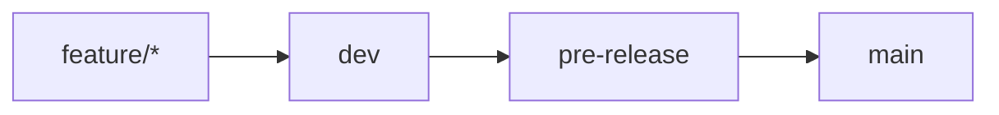

# Branch Protection Guide (.md)

This guide explains how to protect branches in GitHub using **Branch Protection Rules** and **Rulesets**, including step-by-step setup, feature explanations, and best practices.

---

## ✨ Why Protect Branches?

1. Prevent direct pushes to sensitive branches.
2. Enforce Pull Request-based workflow.
3. Require code reviews before merging.
4. Block force pushes and accidental deletions.

---

## 🧩 Difference Between Branch Rules and Rulesets

| Aspect            | Branch Protection Rules                  | Rulesets (Newer, Advanced)                |
|------------------|------------------------------------------|------------------------------------------|
| Scope            | Single branch                            | Multiple branches (via patterns)          |
| Flexibility      | Limited options                          | Advanced conditions and bypass lists      |
| UI Location      | Settings → Branches                      | Settings → Rules                          |
| Access Level     | Available in all tiers                   | Requires GitHub Team/Enterprise to enforce |

---

## 🛠️ How to Add a Ruleset

1. Go to your repository → **Settings**
2. Click **Rules** → **Rulesets**
3. Click **New ruleset**
4. Set the **Ruleset name**, e.g. `Protect dev branch`
5. Under **Target branches**:
   - Choose `Include by pattern`
   - Enter the name or pattern like `dev`, `main`, or `pre-release`

---

## 🔐 Explanation of Rule Options

| Option                                      | Description                                                                 | Recommended Usage        |
|---------------------------------------------|-----------------------------------------------------------------------------|---------------------------|
| **Require a pull request before merging**   | Prevents merging directly to the branch                                     | ✅ Always enabled         |
| **Require approvals**                       | Specifies how many reviewers must approve before merging                    | ✅ 1 or more              |
| **Dismiss stale approvals**                 | Auto-dismiss approvals when new changes are pushed                          | ✅ Useful for safety      |
| **Require review from Code Owners**         | Requires code owners to approve changes to their files                     | Optional                  |
| **Require status checks**                   | Ensure CI checks (tests/lint/etc) pass before merge                         | ✅ If using CI/CD         |
| **Require conversation resolution**         | Prevents merging with unresolved PR comments                                | ✅ To improve collaboration |
| **Require signed commits**                  | Commits must be cryptographically signed                                    | Optional                  |
| **Require linear history**                  | Disallows merge commits, enforces rebase-based history                      | Optional                  |
| **Require deployments to succeed**          | Only allow merging after successful deployment                              | Advanced use only         |
| **Block force pushes**                      | Disallows `git push --force`                                                | ✅ Recommended             |
| **Allow deletions**                         | Allow the branch to be deleted                                              | ❌ Best disabled           |
| **Lock branch**                             | Make branch read-only (no pushes, no PRs)                                   | For frozen branches only  |
| **Do not allow bypassing the above settings** | Applies rules even to admins and custom roles                               | ✅ If strict control needed |
| **Restrict who can push**                   | Limit push access to selected people/teams                                  | ✅ Especially for `main`   |

---

## 📌 Example: Protecting the `dev` Branch

- **Target**: `dev`
- ✅ Require pull request before merging
- ✅ Require 1 approval
- ✅ Dismiss stale approvals
- ✅ Require conversation resolution before merging
- ✅ Block force pushes
- ❌ Allow deletions
- ❌ Allow force pushes

---

## 🏠 Suggested Branch Workflow & Responsibilities

| Branch         | Maintainers        | Accepts Pull Requests from     |
|----------------|--------------------|--------------------------------|
| `feature/*`     | Individual Devs    | N/A                            |
| `dev`           | All Devs via PR    | From `feature/*` branches      |
| `pre-release`   | Reviewer/Admin     | From `dev`                     |
| `main`          | Admins only        | From `pre-release`             |

---

## 📌 Branch Strategy Workflow

### Branch Responsibilities

| Branch | Protection Level | Required Reviews | Status Checks |
|--------|-----------------|------------------|---------------|
| `main` | Maximum | 2+ | All |
| `pre-release` | High | 2 | All |
| `staging` | Medium | 1 | All |
| `dev` | Medium | 1 | Basic |
| `feature/*` | Low | 1 | Basic |

---

## ⚠️ Note About Free Accounts

Rulesets and some protections **are not enforced** on **private repos** unless the organization upgrades to GitHub Team or Enterprise.

---
## ⚠️ Common Issues & Solutions

### 1. Merge Conflicts
- Regular rebasing
- Clear branch strategy
- Automated conflict detection

### 2. Review Delays
- Set review deadlines
- Use review reminders
- Implement review rotation

### 3. CI/CD Integration
- Optimize pipeline speed
- Use status check caching
- Implement parallel jobs
---

## 🎯 Additional Resources

- [GitHub Branch Protection Documentation](https://docs.github.com/en/repositories/configuring-branches-and-merges-in-your-repository/defining-the-mergeability-of-pull-requests/managing-a-branch-protection-rule)
- [GitHub Actions Documentation](https://docs.github.com/en/actions)
- [GitHub Security Best Practices](https://docs.github.com/en/code-security/security-advisories/security-advisories)

---

Feel free to expand this with visuals or organization-specific examples as needed.
