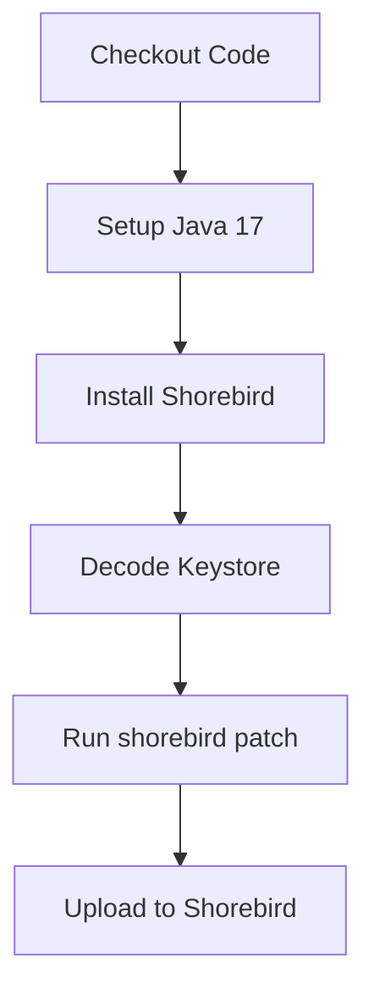
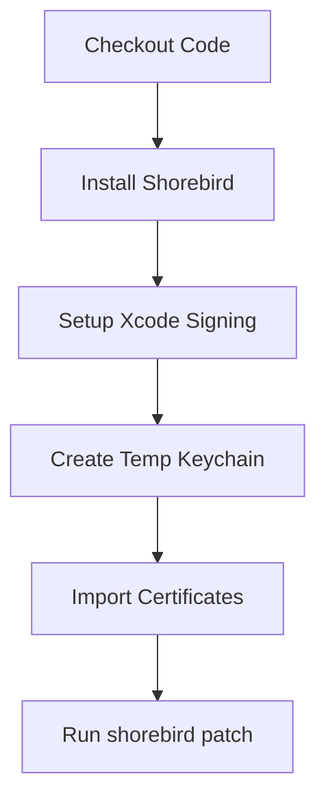

# 🚀 Flutter Hotfix Deployment with Shorebird


This project automates hotfix deployments for Flutter apps using Shorebird's patching system, allowing instant delivery of critical fixes without full app store updates.

## 📌 Table of Contents

- [Workflow Features](#-workflow-features)
- [Quick Start](#-quick-start)
- [Required Secrets](#-required-secrets)
- [Workflow Breakdown](#-workflow-breakdown)
- [Tagging Convention](#-tagging-convention)
- [Technical Details](#-technical-details)
- [Troubleshooting](#-troubleshooting)
- [Resources](#-resources)

## 🔧 Workflow Features

- **Zero-downtime patching** for production apps
- **Parallel platform builds** (Android + iOS)
- **Secure credential management** via GitHub Secrets
- **Tag-based triggering** (e.g., `v1.0.0-hotfix.1`)
- **Staging environment support** (`--staging` flag)

## ⚡ Quick Start

### 1. Prerequisites

- Configured [Shorebird CLI](https://shorebird.dev/docs/get-started)
- Valid code signing assets (keystore for Android, certificates for iOS)

### 2. Create a Hotfix

```bash
# Create and push a hotfix tag
git tag -a v1.0.0-hotfix.1 -m "Emergency login fix"
git push origin v1.0.0-hotfix.1
```

### 3. Automatic Deployment

The workflow will:

1. Build platform-specific patches
2. Deploy via Shorebird
3. Appear in Shorebird console within minutes

## 🔐 Required Secrets

Add these in GitHub → Settings → Secrets → Actions:

| Secret Name               | Description                          | Example Format       |
|---------------------------|--------------------------------------|---------------------|
| `SHOREBIRD_TOKEN`         | Shorebird API token                  | `sbird_xxxxxx`      |
| `KEYSTORE`                | Base64-encoded Android keystore      | `base64 output`     |
| `KEYSTORE_PASSWORD`       | Keystore password                    | `s3cr3tP@ss`        |
| `KEYSTORE_ALIAS`          | Key alias name                       | `upload`            |
| `CERTIFICATE`             | Base64 iOS .p12 file                 | `base64 output`     |
| `CERTIFICATE_PASSWORD`    | iOS certificate password             | `app1eP@ss`         |
| `PROVISIONING_PROFILE`    | Base64 mobile provisioning profile   | `base64 output`     |
| `KEYCHAIN_PASSWORD`       | Temporary keychain password          | `tempS3cret`        |

To encode files:

```bash
# Android Keystore
base64 -i your.keystore > keystore_base64.txt

# iOS Assets
base64 -i Certificates.p12 > certificate_base64.txt
base64 -i Profile.mobileprovision > profile_base64.txt
```

## 🌊 Workflow Breakdown

### Android Patch Job



### iOS Patch Job



## 📌 Tagging Convention

```bash
vMAJOR.MINOR.PATCH-hotfix.NUMBER
```

Examples:

- `v1.2.3-hotfix.1` (First hotfix for v1.2.3)
- `v2.0.1-hotfix.3` (Third hotfix for v2.0.1)

## 🛠️ Technical Details

### Android Configuration

```groovy
// android/app/build.gradle
signingConfigs {
    release {
        storeFile file(System.getenv("KEYSTORE_PATH") ?: "debug.keystore"
        storePassword System.getenv("KEYSTORE_PASSWORD")
        keyAlias System.getenv("KEYSTORE_ALIAS")
        keyPassword System.getenv("KEY_PASSWORD")
    }
}
```

### iOS Configuration

```yaml
# Required in workflow:
- uses: shorebirdtech/shorebird-patch@v0
  with:
    platform: ios
    args: "--export-options-plist ios/GHAExportOptions.plist --staging"
```

## 🚨 Troubleshooting

### Common Issues

| Error | Solution |
|-------|----------|
| `403 Forbidden` | Verify service account permissions in Play Console |
| `Invalid keystore` | Re-encode with `base64 -i keystore.jks` |
| `Code signing failed` | Check certificate expiry dates |
| `Shorebird auth failed` | Regenerate `SHOREBIRD_TOKEN` |

### Debugging Tips

1. Check workflow run logs
2. Verify secrets are properly encoded
3. Test locally with Shorebird CLI:

   ```bash
   shorebird patch android --verbose
   ```

## 📚 Resources

- [Shorebird Documentation](https://shorebird.dev/docs)
- [GitHub Actions for iOS](https://docs.github.com/en/actions/deployment/deploying-xcode-applications)
- [Flutter App Signing Guide](https://flutter.dev/docs/deployment/android#signing-the-app)
- [Play Console API Access](https://developers.google.com/android-publisher/getting_started)

---

> **Note**: This workflow is designed for critical hotfixes only. For full releases, use standard app store deployment pipelines.
